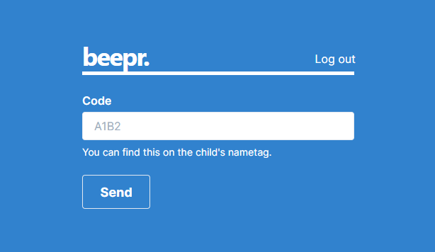

# beepr.

> A free, mobile-minded, Planning Center app to page parents during church services.

**[Homepage](https://beepr.vercel.app)**
**[Demo](https://beepr.vercel.app/demo)** (no account needed!)

## About

**beepr.** allows churches that currently use [Planning Center Check-Ins](https://www.planningcenter.com/check-ins) to easily page parents during church services via text message in the case their child needs their attention in childcare.

This app implements and utilizes OAuth2 authentication via the [Planning Center API](https://www.planningcenter.com/developers), and uses its API to query the emergency contact of the child. Then, the [Twilio API](https://www.twilio.com/) is used to send an SMS message to the phone number on file.

Because all queries and logic happens in the back-end of the application, this is the ideal app for volunteers as no private household information is exposed. The only thing that the volunteer needs is at least a **_Viewer_** designation to be able to access the application.

## Built With

- [Next.js](https://nextjs.org/)
- [NextAuth.js](https://next-auth.js.org/)
- [MongoDB Atlas](https://www.mongodb.com/cloud/atlas)
- [Planning Center API](https://www.planningcenter.com/developers)
- [Twilio](https://www.twilio.com/)
- [Chakra UI](https://chakra-ui.com/)
- Deployed on [Vercel](https://vercel.com/)
